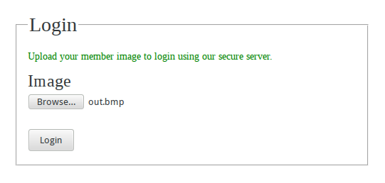

+++
title="Backdoor CTF 2014 - Misc 250-2 Writeup"
date="2014-03-24"
description="A writeup for a steganography challenge that we solved in Backdoor CTF 2014"
author="Nagesh Podilapu"
[taxonomies]
tags=["ctf", "web", "steganography"]
+++
<!-- assetID: 9b95a7734712c5ef1820f4da19568850 -->
In this challenge they gave a link to a web page and an image named **backdoor.bmp** as login credentials.



Seems very interesting and after submitting the given image to website it replies

```
Logged in as backdoor. For a change login as 'sdslabs' user.
```

So the given image is a credential for the user named **backdoor**, and now we have to make an image for user **sdslabs** and login with that image to get flag.
After observing the pixels of the image for nearly 2 hours, I found a word in LSB bits of the given image and that is **backdoor**. Obviously the website checks for the LSB bits to check username. Here is my script that collects all LSB bits and converts it into a ASCII string.

```python
from PIL import Image
im=Image.open('backdoor.bmp','r')
pix=im.load() # Load all pixels
w,h=im.size
bis=""
for i in range(h):
    for j in range(w):
        bp=pix[j,i][2] # Getting Blue Pixel Value
        bis+=bin(bp)[-1] # Converting Blue pixel into Binary and taking LSB bit.
st=""
for i in range(0,len(bis),8):
    st+=chr(int(bis[i:i+8],2))  # Converting Binary data into ASCII Text.
print st
```

And the output of the above code is

```
backdoor��������������������������������
              ����@��������������?��@
```

So, the first 8 characters string **backdoor** formed by first 64 pixels LSB. Now our task is to make a new image with LSB bits as **sdslabs**. I quickly wrote a script to do so

```python
from PIL import Image
im=Image.open('backdoor.bmp','r')
pix=list(im.getdata()) # Convert all pixels into an Array
out_pix=[]
#Binary String Equivalent to "sdslabs"
sd="0111001101100100011100110110110001100001011000100111001100000000"
c=0
for i in range(len(pix)):
    r=pix[i][0]
    g=pix[i][1]
    if(i<=63):
        b=int(sd[c]) # Modifying LSB with our binary string
        c=c+1
    else:
        b=pix[i][2]
    out_pix.append((r,g,b))
out_im=Image.new(im.mode,im.size) # Creating a new image
out_im.putdata(out_pix) # Put Pixels array into the output image
out_im.save("out.bmp","BMP") # Saving Image
```

Above code resulted in an image and after submitting it in login page we got success response.

```
Logged in as 'sdslabs'
Congrats the flag is {practice_makes_one_perfect}
```

Hurray! Team [r3b00+](https://ctftime.org/team/4882) pawned 250 points.