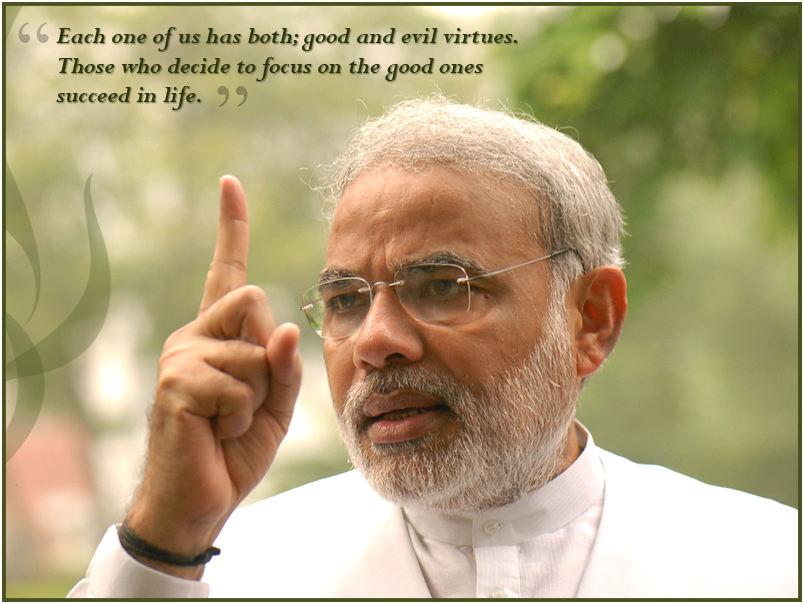

+++
title = "InCTF 2014 - Forensics 400 - MODIfied"
date =  "2014-03-08"
description = "A writeup on a CTF challenge that I solved in InCTF 2014, this is a steganography challenge which uses Least Significant Bit technique"
author = "Nagesh Podilapu"
[taxonomies]
tags = ["ctf", "steganography", "python"]
+++

Every time when I see a stego challenge, I am very frustrated at first but in the end I feel like I achieved something. Stegano challenges keep on changing with different type of tricks. This time it's quite a difficult trick but not beyond our imagination. In this challenge they gave an image of Modi.



File name **MODIfied.png** itself indicating that it's modified. After some careful observations I stumbled upon some pixels in the white border that are modified which are in 1st column of the image.

```
(255, 255, 255)
(255, 255, 254)
(255, 255, 255)
(255, 255, 254)
(255, 255, 254)
(255, 255, 255)
(255, 255, 254)
(255, 255, 255)
```

Then I extracted all the pixels in the 1st column of the white border. After observing some of the pixels I found some of the pixels with 254 values at blue layer, but that's different from a white pixel (255, 255, 255). After that I assumed 255 as 0 and 254 as 1, and got a binary string, after converting it into string I got the flag. Here is the python script that will do the job.

```python
from PIL import Image
a=Image.open('MODIfied.png','r')
pix=list(a.getdata())
mo_i=[]
for i in range(0,len(pix)):
	if((i+1)%804==1):
		mo_i.append(pix[i])
bina=""
for j in mo_i:
	if(j[2]==255):
		bina+="0"
	else:
		bina+="1"
flag=""
print "[+] Checking for Flag ..."
print "[+] Found a flag..."
for i in range(0,len(bina),8):
	flag+=chr(int(bina[i:i+8],2))
print flag
print "[+] Oh! Here it is..."
```

And the Flag is: **{m0d1_thE_NeW_Pm}**

Team [r3b00+](https://ctftime.org/team/4882) awarded with 400 points
