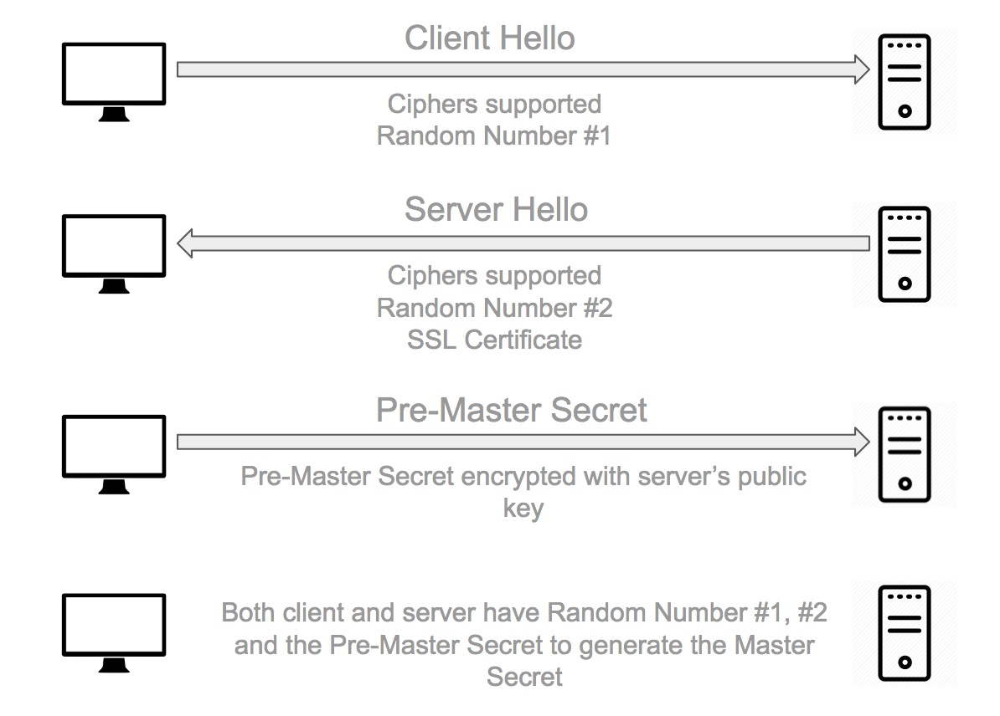
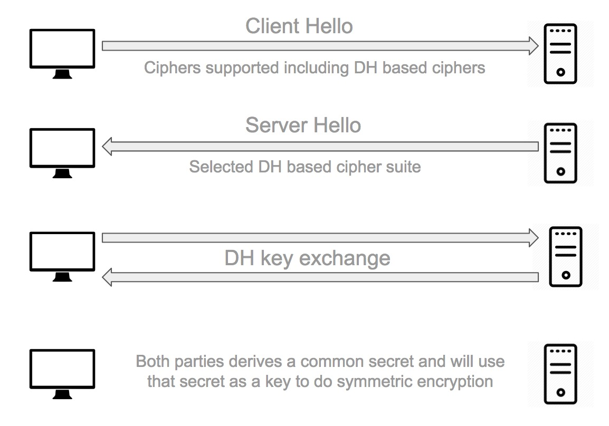
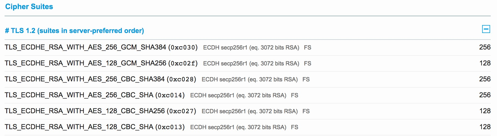

+++
title="Introduction to Perfect Forward Secrecy"
date="2017-03-28"
description="A brief introduction to Perfect forward secrecy. How will this impact our secure communications, why should be care about it."
author="Nagesh Podilapu"
aliases=["2017/03/28/introduction-to-perfect-forward-secrecy.html"]
[taxonomies]
tags = ["security", "heartbleed", "ssl"]
+++

Ever heard about Heartbleed[1]?

The Heartbleed bug allows anyone on the Internet to read the memory of the systems protected by the vulnerable versions of OpenSSL software. This compromises private keys that used to decrypt HTTPS requests. This allows attackers to eavesdrop on communications, steal data directly from the services and users and to impersonate as well.

 
# What do we have before Perfect Forward Secrecy?

Prior to the implementation of PFS, all data transmitted between a server and a client could be compromised if the server's private key was ever disclosed. The ability to decrypt the historic data is there because we rely on a single key pair from server which is used in establishing secure connection.

If attacker captured all the above mentioned traffic, they have **Random Number #1** and **#2** as they are sent in plain text, along with the **Pre-Master Secret** encrypted with the server public key. Once the attacker has the server private key, they can decrypt the Pre-Master Secret and generate the Master Secret to decrypt the session data.

# How does Perfect Forward Secrecy help?

To enable PFS, the client and the server have to be capable of using a cipher suite that utilises the Diffie-Hellman key exchange.
Importantly, the key exchange should be ephemeral (i.e A brand new key for each key exchange session).

This means that the client and the server will generate a new set of Diffie-Hellman parameters for each session. These parameters can never be re-used and should never be stored. Because of logarithmic math complexity in Diffie-Hellman, the exchange of key material can take place in clear text without compromising the generation of a shared secret.

What's even better is that with Perfect Forward Secrecy, the server generates a new set of Diffie-Hellman parameters for each session. Even if the attacker managed to compromise this shared secret parameters somehow, it would only compromise that particular session. No previous or future sessions would be compromised.

# How do I get Perfect Forward Secrecy?
Enabling support for Perfect Forward Secrecy on your server is actually fairly straight forward. All we have to do is to support Diffie-Hellman based SSL cipher suites, and we should also enforce the ordering of cipher suites. Below are some cipher suites used to achieve Perfect Forward Secrecy

And the only problem here is that old browsers don't have support for Diffie-Hellman based key exchange thus don't support PFS.

# What does this have to do with Heartbleed?

Heartbleed bug allows attacker to extract private key from server memory. Once the private key is compromised, there are 2 big problems.

First one, an attacker can act like the server by presenting the certificate that it now has the private key for. This problem can be dealt with by revoking the certificate in question so that browsers know not to trust it.

Secondly, they can intercept and decrypt traffic. If an attacker has been recording encrypted traffic and storing it (take that NSA! 😅), once they gain access to the private key, they can go back and decrypt all of the data that they have intercepted in the past. All that historic data is now vulnerable. This is what Perfect Forward Secrecy prevents.

Because the session key is derived with the help of Diffie-Hellman key exchange for each session, even with access to the private key, there isn't actually any useful information for an attacker to decrypt. They will still have to break each individual session key for each individual session, which, as it stands right now, is a close to impossible task.

# Conclusion

While there is a minor overhead introduced with the addition of Perfect Forward Secrecy, It is definitely worth to take all the benefits it brings. And overhead caused by PFS is still not to the extent that hosts shouldn't be able to handle it.

To check and get a status of how good is your website grade is, use [SSL Test](https://www.ssllabs.com/ssltest/), which will check whether your website has support for PFS or not.

**References:**

[[1] http://heartbleed.com/](http://heartbleed.com/)