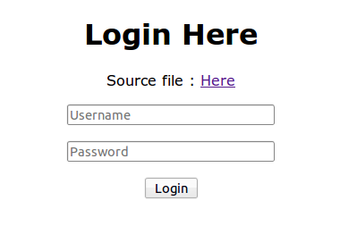
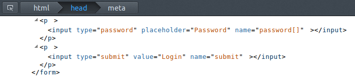

+++
title="InCTF 2014 - Web 100 Writeup"
date="2014-03-08"
description="A writeup on PHP string function vulnerabilities that we exploited as part of a web challenge in InCTF 2014"
author="Nagesh Podilapu"
[taxonomies]
tags=["ctf", "web", "php"]
+++

This is a simple web challenge. In this they gave a web page like below with a simple login form with POST method and a link to php source file as well.



And here is the source code in PHP

```php
<?php
include 'foo.php';
$user = $_POST['username'];
$pass = $_POST['password'];
if( !strcasecmp($user, "admin") && !strcasecmp($pass, $secret)) {
    echo"<h1>$flag</h1>";
}
else {
    echo"<h1>No flag for n00bs..</h1>";
}
?>
```

It's apparent that the program will compare a POST parameter named password against a string **$secret** using the **strcasecmp()** function, If the result of this comparison is 0 then flag is displayed.

Focusing on the the strcasecmp function, need to find whether there are any other ways to make output of this function to 0, besides the obvious case where the strings were equal.

After a quick trip to php.net, I found out that, In modern php versions, the strcasecmp() function will return 0, **if any of the parameters is an array.**

So, I changed name of the password field to **password[]** (This makes $_POST["password"] an array)



And then I submitted that form with username "admin".

I got the flag: **flag{fb1186d3dfd25773d51964cf0d62d302}**
