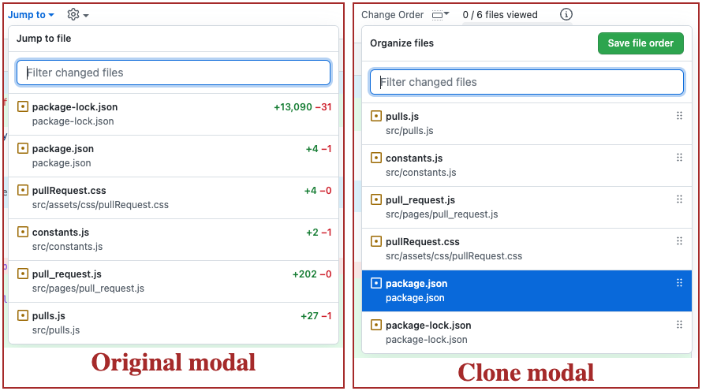

+++
title="Vanilla JS is powerful!"
date="2022-09-17"
description="As part of an internal hackathon at Yelp, we built a new feature to an existing chrome extension used internally. This blog summarizes my experiences with Vanilla JS."
author="Nagesh Podilapu"
[taxonomies]
tags = ["javascript", "dom"]
+++

Hey y'all 👋🏾 we had an internal 3-day hackathon at Yelp, and this is an excerpt of my experiences building a new feature to an existing chrome extension used internally. This extension adds new features to our internal Github enterprise instance.

This feature idea is ~2 years old, and what can be a better time to work on it than a hackathon?

Most of the learnings are **pretty basic stuff**, and nothing fancy! However, this is more for beginners and also for my future self.

# So, what problem this new feature solves?
A lot of people find it difficult to read diff of a Github PR when there are a lot of file changes. And part of the problem is that the file changes are not displayed in a readable order.

Imagine you made a PR with an important config change along with some source changes and test changes, you would want your reviwer to read the config file change first and then the code changes, right?

However, github doesn't display the diff in this order, does it? That's the problem right there!

# How did we solve it?
So the big idea is to show a small UI on **Files Changed** section of a github PR, where users can re-arrange changed file paths in the order it's easier to read the PR, and when they are done, they press a button and that will save these arranged file paths into their clipboard and asks them to post it in the PR description/body.

From this point on, if anyone opens this PR, the extension will read the saved file list from PR description and shows the file diffs in user configured order.

We came up with some better ideas than this, but this is simpler and faster to implement!

# So, what did we learn?
This internally used chrome extension can only access DOM and nothing else. So we have to play with the dreaded DOM manipulation! In the process we learned 4 simple things.

## 1. Rearranging divs is easy!

At first I thought I'll have to re-create elements in the required order, clean up existing elements and then add newly created elements to parent container. I learned that we don't have to do all that!

If you query select a div in JS which has 10 children and re-arrange these children in JS, and append them all back to this selected div, this will re-arrange the divs!


```javascript
const diffContainer = filesContainer.querySelector(".js-diff-container")
// Shuffle these divs
const diffDivs = Array.from(container.children).sort(_ => Math.random() - 0.5)
// And add them back to the parent div
diffContainer.append(...diffDivs)
// You have the diffs re-arranged!
```

## 2. MutationObserver is helpful!
When you have to observe changes to a specific DOM node (you want to know when user switches between tabs in a single page application), [MutationObserver](https://developer.mozilla.org/en-US/docs/Web/API/MutationObserver) is your friend!

```javascript
const mutationObserver = new MutationObserver((mutations) => {
    const areNodesAdded = mutations.some(mut => mut.addedNodes.length > 0)
    if (areNodesAdded) {
        // Do something for fun and profit!
    }
})

mutationObserver.observe(document.querySelector('#diff-layout'), {
    childList: true,
    subtree: true
})
```

## 3. You can deep clone an existing DOM node!
We had to build this UI where we want to display list of file paths! And lucky for us, github already have this kind of UI element. So, all we need to do is clone it and customize it a bit for our needs.

```javascript
const existingModal = document.querySelector("details.toc-select")
const cloneModal = existingFileListingModal.cloneNode(true)
```



## 4. SortableJS is amazing!
Part of the feature is to allow users to re-arrange file paths in a UI view, and for that we need to allow drag and drop of file paths so user can re-arrange them as they need. For this requirement, we found [SortableJS](https://sortablejs.github.io/Sortable/) which is minimal and ticks all the boxes!

All you need to do is pass a div, and all it's childen can be re-arranged!

```javascript
new Sortable(document.querySelector("#file-paths-container"), {
    animation: 150,
    ghostClass: 'blue-background-class'
})
```

# Conclusion
Relying on DOM and parsing it isn't fun, but for a hackathon it's alright! JavaScript and the DOM APIs came a long way from my university days. Vanilla JS is magnitudes powerful and has a lot of support for immutablity and declarative style of code, we can do so much with so little JS code these days!
